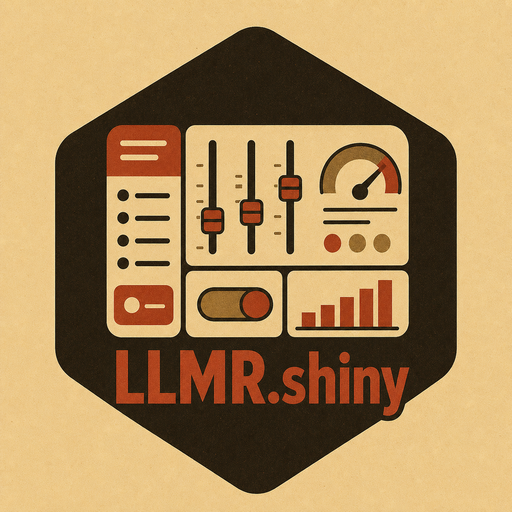

# LLMR.shiny 

<!-- badges: start -->
[](https://github.com/asanaei/LLMR.shiny/actions/workflows/R-CMD-check.yaml)
[](https://opensource.org/licenses/MIT)
[](https://asanaei.github.io/LLMR.shiny/)
<!-- badges: end -->

The shared Shiny substrate for the LLMR family of GUIs. Interfaces such as
LLMRpanel, LLMRcontent, and FocusGroup build their apps on this shell and
supply only their package-specific module code; end users normally get
LLMR.shiny as a dependency of those GUI packages rather than installing it on
its own. The shell provides:

- provider and model selection with overrideable model defaults
  (`provider_registry()`, `shell_sidebar()`)
- environment-variable-only API key handling (`key_state()`, never a paste, never
  a printed value)
- a deterministic offline demo runner with durable result provenance and a
  callable live runner (`demo_runner()`, `build_runner()`)
- session usage accounting (`usage_empty()`, `usage_tile()`)
- authentication-sensitive error banners (`safe_llmr_call()`, `llmr_error_banner()`)
- CSV upload and column mapping (`read_csv_upload()`, `map_columns()`)
- a display layer over the shared `diagnostics()` / `report()` generics
  (`report_text()`, `diagnostics_table()`)
- the standard reactive context every GUI server builds (`shell_context()`)

Model fields start blank unless local defaults are supplied, for example with
`options(LLMR.shiny.default_models = c(groq = "your-current-model"))`.

## For GUI authors

In your UI:

```r
bslib::page_navbar(
  title = "MyStudio",
  sidebar = LLMR.shiny::shell_sidebar(),
  bslib::nav_panel("Workflow", my_module_ui("work"))
)
```

In your server:

```r
function(input, output, session) {
  shared <- LLMR.shiny::shell_context(input, output, session)
  my_module_server("work", shared)
}
```

`shared` gives your module `provider()`, `model()`, `mode()`, `key()`,
`can_run()`, `set_plan()`, and `add_usage()`. A change here is available to any
GUI that imports the shared shell.

## Install

End users rarely need this step; the GUI packages pull LLMR.shiny in for you.
To install it directly, from CRAN once released:

```r
install.packages("LLMR.shiny")
```

or the development version:

```r
remotes::install_github("asanaei/LLMR.shiny")
```

LLMR itself is optional for installation: demo mode runs without it. Live
runner calls and live configuration construction require LLMR.
